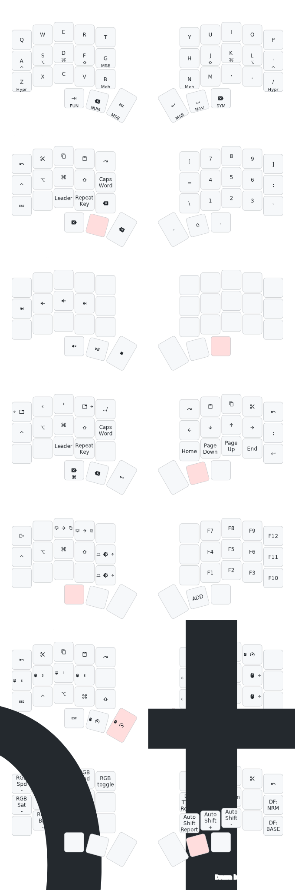
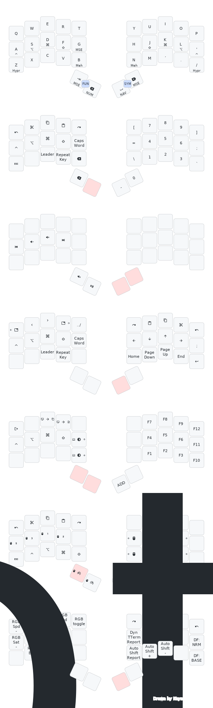

# btgrant-76's userspace

## Core Keymap 

My keymap is heavily inspired by [Miryoku](https://github.com/manna-harbour/miryoku/). The core keymap is managed in [`btgrant.h`](./users/btgrant/btgrant.h). Each layer is divided into left and right halves; the halves are composed of:

* a set of three, 5u rows
* a set of 3u thumb clusters

These rows and thumb clusters are then composed into an individual keyboard's `keymap.c`. Additional keycodes supplement the core keymap where they are required to satisfy the board's defined number of keys.

Big thanks to [waffle87](https://github.com/waffle87) for inspiration and assistance to get this centrally-managed keymap working.

### 36-Key Layout (3 x 5 + 3)

### 34-Key Layout (3 x 5 + 2)

